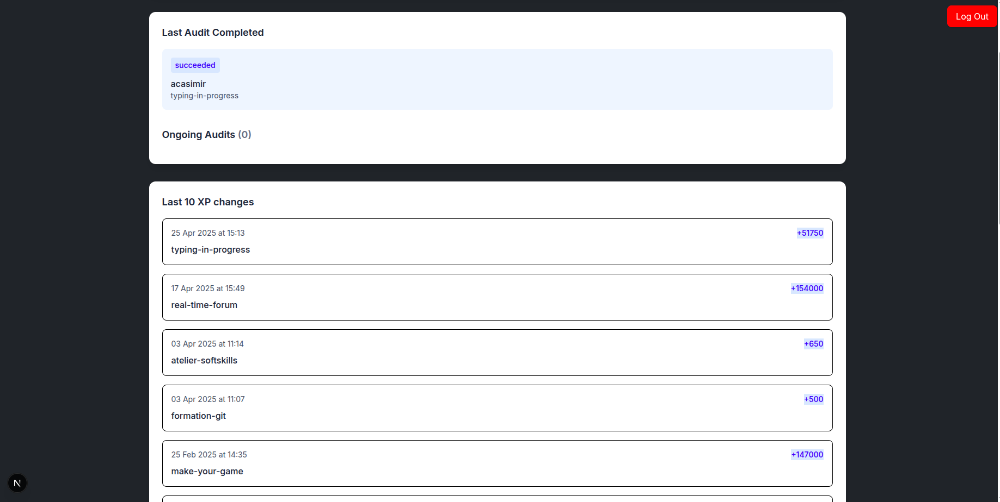

# School Profile Analytics with GraphQL

Tableau de bord interactif présentant les statistiques académiques via GraphQL avec visualisation SVG et authentification sécurisée.

## Fonctionnalités Clés

🔐 **Authentification Sécurisée**
- Connexion par email/nom d'utilisateur
- Gestion des tokens JWT
- Messages d'erreur contextuels
- Déconnexion possible

📈 **Visualisations Dynamiques**
- Section profil personnel (XP, compétences, audits)
- Graphiques SVG interactifs :
  - Comparatif audits validés/rejetés
  - Répartition des compétences

⚡ **Intégration GraphQL**
- Requêtes optimisées en temps réel
- Récupération de données imbriquées
- Système de cache intelligent
- Gestion des erreurs API

## Utilisation

Accédez à la plateforme déployée :
[https://graph-ql-self.vercel.app/](https://graph-ql-self.vercel.app/)
